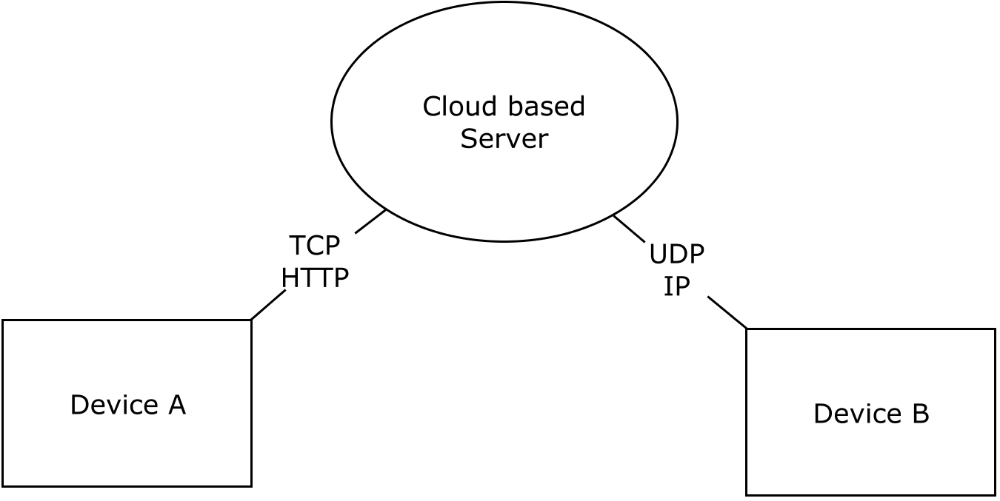
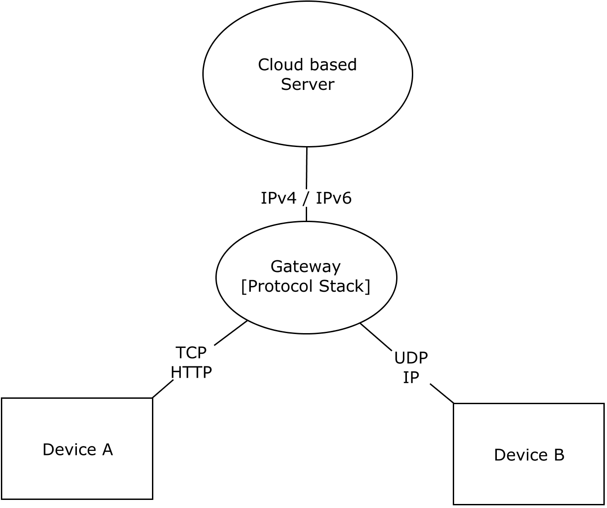

#   IoT Server Framework Proposal
Django server for IoT-based data transmission infrastructure proporsal 

----------
# Table of Contents
## 1. [Overview](#example)
## 2. [Installation](#installation)
## 3. [User Guide](#user-guide)
## 3. [Wiki](#third-example)

----------

## Installation
First install [python](https://www.python.org/downloads/) from the official site, anything above the 3rd version should work just fine. Make sure to be running the correct version of python when doing commands, to check this call the 'python --version' command in the command line. If a lower version is prompted, try running the 'python3 --version' command, in such case do all the following python-related commands with 'python3' instead.

Once python is installed navigate or create the directory where you want the project to be stored. Once in that directory clone or download the latest zip/tar from [releases](https://github.com/M4CH1N3G1RL/IoT-Rest-Server/releases).

Navigate to the project directory up to the level where this README.md file is stored, we will be refering to this loocation as the root directory from now on.

Once in the root directory, activate the python virtual environment running the following command
```shell
python3 -m venv venv
```
Activate the virtual environment by executing the activate.bat file '.\venv\Scripts\Activate.bat' (Windows). If working in Linux, source the 'activate' file 'source venv/bin/activate'

Once the virtual environment is activated the main command line pront should be prefixed by a '(venv)' quote and all the python-related commands will be executed by the activated environment. 

Install the required packages using pip from the 'requirements.txt' file using the following command:
```shell
pip install -r requirements.txt
```
<p style="text-align: center;">


</p>
Note that if you are installing from a *nix plataform you will get an error about the twisted-iocpsupport package, since linux supports epoll you shall ignore this message and continue with the installation. 

You are now ready to run the server using daphne, navite to 'djangoPython/mysite/' directory where 'manage.py' lives. This is the server's main directory were all the deployment commands should be executed.

To start the server run:
```shell
daphne mysite.asgi:application
```
<p style="text-align: center;">


</p>
 
Use any web browser at your local host to see the running server, to do this navigate to 'http://127.0.0.1:8000/'

## User Guide


##  Objectives

 - As an implementations User
    - Send data via https to the Server/Cloud for later use or post-processing
    - 

 - As a Design User
    - Use it for design yo
    -

### Characteristics

- State Monitoring
- State Posting/Listening
- http // ws support

##  Definitions
***Element*** - Small processig unit/computer composed of I/O interfaces, sensors, transduscers, etc. It can also be defined as the client from the Server's Perspective. It is assumed that an element communicates wirelessly, or at least is able to communicate to an Access Point. An element is the definitive source of data, the eyes of the IoT environment.

***Server*** - Also refered to as the Cloud, It is the main Processing Unit with a bunch of responsibilities: Orchestrates the communication between elements, acts as a gateway allowing compatibility between different protocols, saves data to the database, runs complex algorithms, outputs data to the elements, among others. Shall we not forget that the server is just a process running in some good-spec'ed computer.

##  US

- As an implementation dude, I want to be able to communicate an element wirelessly to a main Processing Unit, so I can process the data independently from the source of origin.
- As a designer, I want to retrieve an element data from a database 

IoT Server Framework Proposal

##  General

<p style="text-align: center;">


</p>

Placeholder

### Frame Structure

The frame is implemented by a python dictionary which is later "dumped" to a json format for further compatibility.

<p style="text-align:center;">
[describe frame]
</p>

#   User Guide
[Put a nice user guide here]


#   Test Zone
> something 
>> something2
>>> something3

<p style="text-align:center;">
something
</p>







